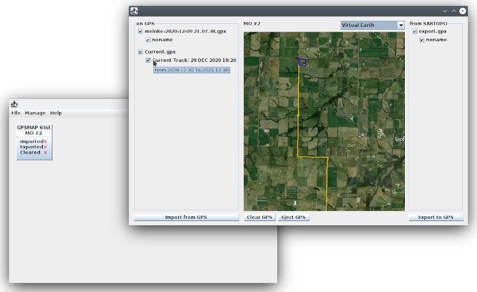

# Meinke
Java app to assist importing/exporting between Garmin GPS and Sartopo

## Installation
1. Java 11 or newer MUST be installed. Select "JDK Download" [https://www.oracle.com/java/technologies/javase-downloads.html](https://www.oracle.com/java/technologies/javase-downloads.html)
2. Download and run the latest [Meinke.jar release.](https://github.com/sammyizimmy/Meinke/releases)
3. Configure ToGPS and FromGPS folders
4. It will open a window. Meinke.jar needs to be told where to look for files and where to save files. That is found under File/ Setting.
5. If a GPS is connected it will show the GPS as an icon. 
    Right clicking it. Gives the option of giving the GPS an unique alias.
    Left clicking.(having an sd card inserted might make it take a minute for it to pop up) Brings up a new window that has a map. It will show everything that is on the GPS. 
    Importing will send it to the folder you selected previously.
    "Clear GPS" deletes everything from the GPS except the current track. Eject GPS will eject it and auto restart it. 
    Export to GPS. Select what you want to export. It will ask if you want to export map tile. Resize the map to the size you want to upload to the GPS and choose the map from the dropdown. Such as mapbuilder hybrid or global imagery. (This is where having a newer GPS is worth it since older ones don't show as much detail.).
6. It will then ask if you want to eject. Ejecting can be buggy if a GPS has an sd card inserted.

##Using it with Sartopo. 
1. Importing. Import-> choose files-> select the folder configured with Meinke.
2. Exporting. Export-> GPX-> select items-> place in folder configured with Meinke (each browser/pc might do it a bit different. Such as auto send to download folder.
3. It does not export to multiple ones simultaneously, but multiple can be plugged in and selected between easily if named with unique names. Such as GPS number or owner's name.

##TODO
1. Batch operations, import/export to all connected units.
